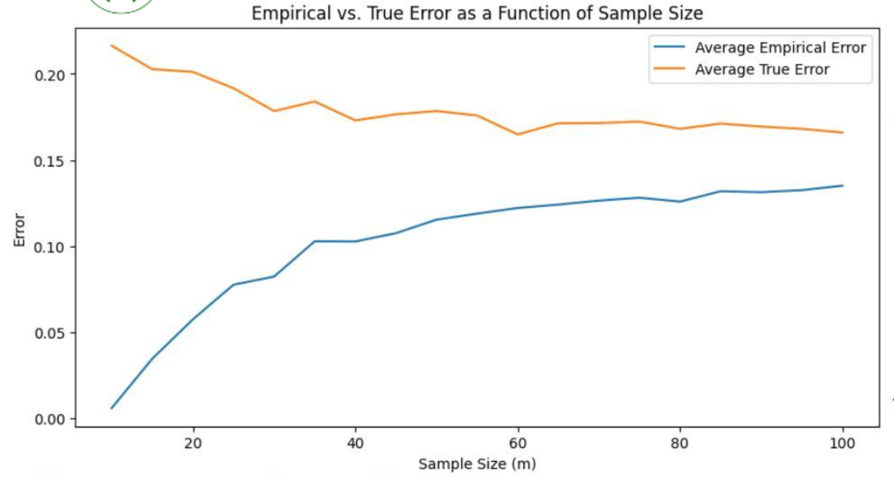
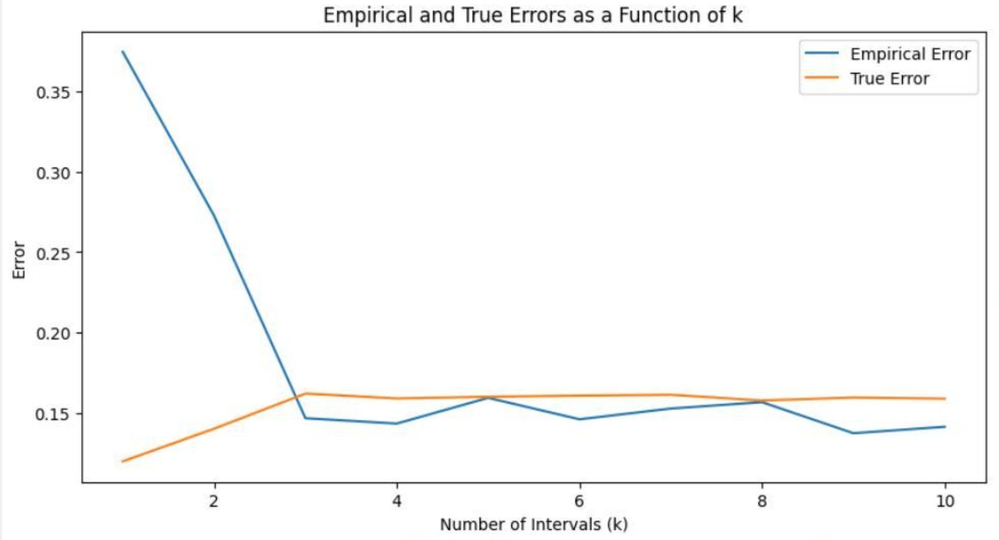

# Results & Analysis 📊

## **Union of Intervals - Problem Description**

In this assignment, we study the hypothesis class of a **finite union of disjoint intervals** and analyze the properties of the **Empirical Risk Minimization (ERM) algorithm** for this class.

Let the sample space be 𝒳 = [𝟢,𝟣] and consider a **binary classification problem**, where 𝒴 = \{𝟢,𝟣\} . We aim to learn using a hypothesis class consisting of **𝒌 disjoint intervals**.

### **Mathematical Formulation**
We define a hypothesis class of disjoint intervals as follows:

Let 𝐼 be a set of  𝑘 disjoint intervals:
𝐼 = \{[𝓁₁, 𝓊₁], [𝓁₂, 𝓊₂], ..., [𝓁ₖ, 𝓊ₖ]\}
where the intervals are ordered such that:

𝟢 ≤ 𝓁₁ ≤ 𝓊₁ ≤ 𝓁₂ ≤ 𝓊₂ ≤ ... ≤ 𝓊ₖ ≤ 𝟣

For each such set 𝐼, define the corresponding hypothesis function:

The hypothesis class ℋₖ consists of all possible such hypotheses:
ℋₖ = \{ ℎₗ | I = \{[𝓁₁, 𝓊₁], ..., [𝓁ₖ, 𝓊ₖ]\}, 𝟢 ≤ 𝓁₁ ≤ 𝓊₁ ≤ 𝓁₂ ≤ 𝓊₂ ≤ ... ≤ 𝓊ₖ ≤ 𝟣 \}

We are given a labeled sample of size n:
 (𝑥₁, 𝑦₁), ..., (𝑥ₙ, 𝑦ₙ)
where the points xᵢ are sorted in increasing order:  𝟢 ≤ 𝑥₁ < 𝑥₂ < ... < 𝑥ₙ ≤ 𝟣.

---

## **(a) Hypothesis Selection with Minimum Error**

### **Problem Statement**
We assume the true distribution  𝑃[𝑥,𝑦] = 𝑃[𝑦|𝑥]∙𝑃[𝑥] is given as follows:
- 𝑥 is uniformly distributed over [𝟢,𝟣].
- The conditional probability 𝑃\[𝑦 = 𝟣|𝑥\] is defined as:

- Since 𝑃\[𝑦 = 𝟢|𝑥\] = 𝟣 - 𝑃\[𝑦 = 𝟣|𝑥\], we can compute the exact error 𝑒ₚ(ℎ) for any hypothesis ℎ∊ℋₖ.

### **Solution**
For ℎ ∊ ℋ₁₀, the error is computed as:

Since 𝑋 is uniformly distributed over [𝟢,𝟣], we use 𝑃\(𝑋,𝑌\) = 𝑃\(𝑌|𝑋\)𝑃\(𝑋\) to rewrite:

We focus only on cases where Δ𝑧ₒ ≠ 0 , meaning incorrect predictions:
- I₁: Intervals where ℎ(𝑋)=𝟣 and 𝑃\(𝑌=𝟣|𝑋\) = 0.8 (no error, ignored)
- I₂: Intervals where ℎ(𝑋)=𝟣 and 𝑃\(𝑌=𝟣|𝑋\) = 0.1 (error occurs)
- I₃: Intervals where ℎ(𝑋)=𝟢 and 𝑃\(𝑌=𝟣|𝑋\) = 0.8 (error occurs)
- I₄: Intervals where ℎ(𝑋)=𝟢  and 𝑃\(𝑌=𝟣|𝑋\) = 0.1 (no error, ignored)

Thus, the expected error simplifies to:

To minimize error, we aim to keep I₂ and I₃ as small as possible. One approach is to introduce a small unit 𝜀 > 0 at the interval edges, ensuring exactly 10 disjoint segments:

where:
- 𝑛₁ is the number of intervals added to the complement of [0,0.2] ∪ [0.4,0.6] ∪ [0.8,1]
- 𝑛₂ is the number of intervals removed from [0,0.2] ∪ [0.4,0.6] ∪ [0.8,1]

This ensures the best hypothesis  ℎ ∊ ℋ₁₀ has the smallest possible classification error.

---

## **(b) Empirical and True Error Analysis**

### **Problem Statement**
We implement a function that calculates the true error 𝑒ₚ(ℎₗ) for a given list of intervals 𝐼 . Then, for 𝑘 = 3  and various values of 𝑛 (10, 15, 20, ..., 100), we conduct the following experiment 𝑇 = 100 times:
1. Draw a sample of size 𝑛 and run the **ERM algorithm**.
2. Calculate the **empirical error** for the returned hypothesis.
3. Calculate the **true error** for the returned hypothesis.
4. Plot the empirical and true errors, averaged across the 𝑇 runs, as a function of 𝑛.
5. Discuss the results: Do the empirical and true errors decrease or increase with 𝑛? Why?

### **Solution & Analysis**
- The **empirical error** increases as 𝑛 grows, but its **rate of increase slows down**, which aligns with theoretical expectations. A **larger sample size provides more information about the true distribution**, allowing for a better hypothesis selection.
- The **true error remains relatively constant**, with slight fluctuations. This behavior is expected because the true error is an inherent property of the hypothesis and the true distribution 𝑃, which do not change with sample size.
- Overall, we observe the expected trend where **as 𝒏 increases, the empirical and true errors converge**, demonstrating the consistency of the ERM algorithm.
#### **Graph:**

---

## **(c) Error Behavior as a Function of 𝒌**

### **Problem Statement**
We draw a sample of size 𝑛 = 1500 and find the best ERM hypothesis for 𝑘 = 1, 2, ..., 10. We then plot the empirical and true errors as a function of 𝑘 and analyze how the error behaves. We also define 𝑘* to be the 𝑘 with the smallest empirical error for ERM and discuss whether this makes 𝑘* a good choice.

### **Solution & Analysis**
- In this experiment, we observed that 𝑘* = 9  yielded the smallest empirical error.
- However, this does not necessarily mean that  is the best hypothesis class. This is because it may lead to **overfitting**, where the selected hypothesis is overly complex and fits the training set too closely, capturing unnecessary noise.
- A hypothesis that generalizes well should have both **low true error** and **low empirical error**. While 𝑘* minimizes the empirical error, it may not perform well on new data.
- A simpler model with a slightly higher empirical error but a lower true error could be a better choice for generalization.

#### **Graph:**

